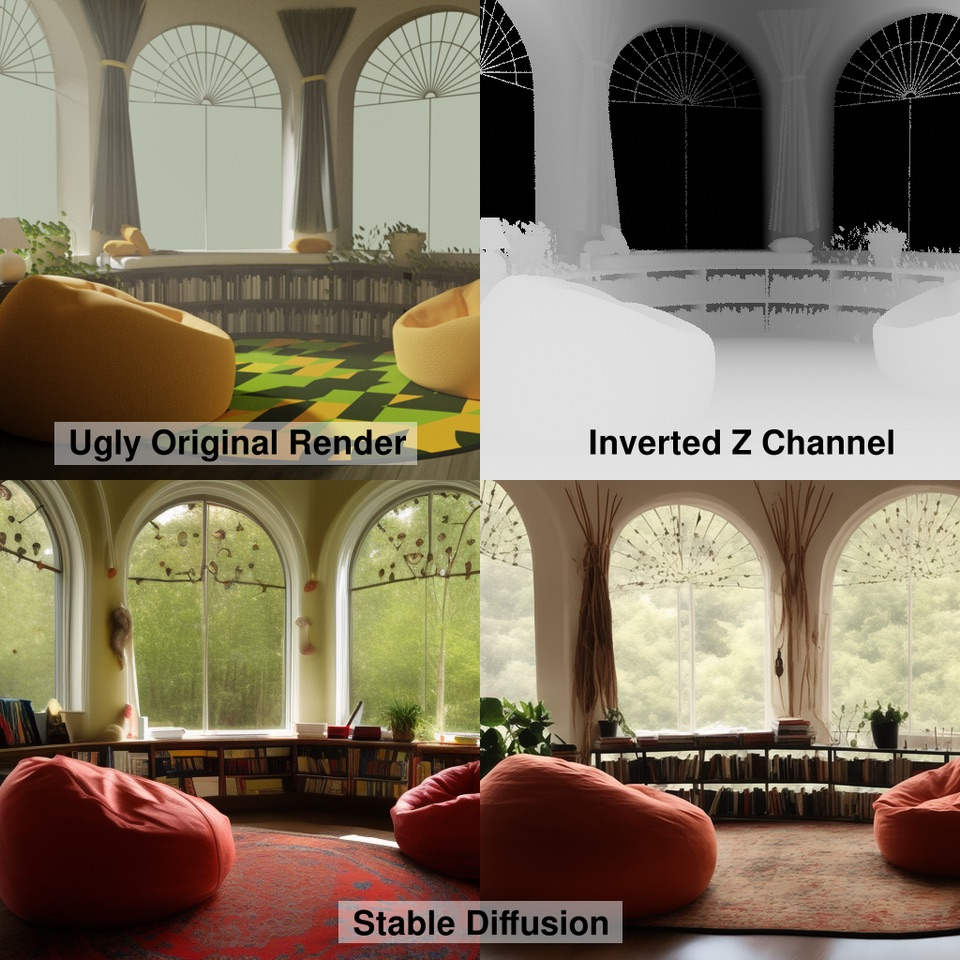

# Blender Depth-map

Source: [Reddit Post](https://www.reddit.com/r/StableDiffusion/comments/zh8ava/using_depth2image_with_detailed_depth_maps_from/)

MiDaS is really good at automatically generating depth maps from 2D images, but it lacks the detail you can get with a true map from a 3D render.

1. Build the scene in Blender. Don't worry too much about texturing or lighting.

2. Render the scene like you normally would.

3. Perform a second render, this time with just the inverted Z (depth) channel.

4. Apply this pull request: [AUTOMATIC1111](https://github.com/AUTOMATIC1111/stable-diffusion-webui/pull/5542)

5. Write a dirty hack so you can use your rendered depth map instead of the one generated by MiDaS

6. In img2img, turn the denoising strength all the way to 1, unless you want to show off the ugly colours you chose for the render

7. Load the normal render into img2img, describe the scene, and hit generate

These instructions currently belong on r/restofthefuckingowl, but I hope it'll get easier as the tools mature.
